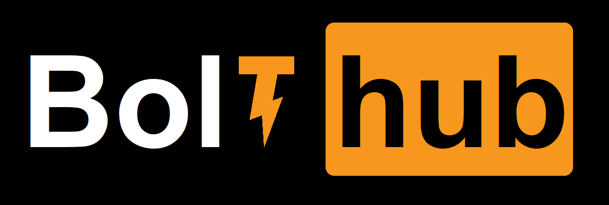
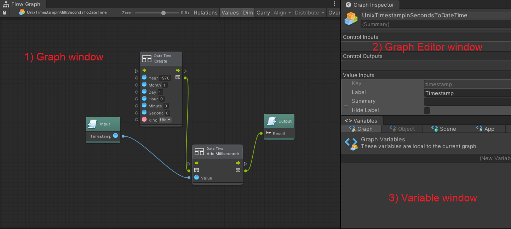
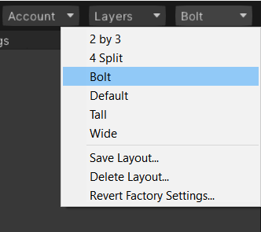
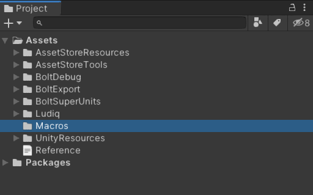
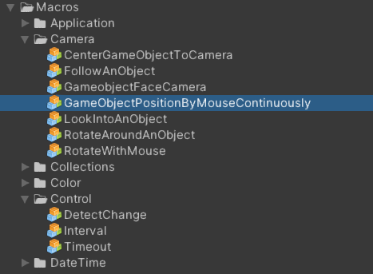

   
  
   
   

# Unity Bolt Style Guide & Best Practice
> This is a guide for create consistent and aesthetically pleasing Unity Bolt Visual Script Graph. It is inspired by what is popular within the community, and flavored with some personal opinions.

## The Guideline Style serve the following purposes:
- They create a consistent look to the graph, so that readers can focus on content, not layout.
- They enable readers to understand the graph more quickly by making assumptions based on previous experience.
- They facilitate copying, changing, and maintaining the graph.

## Layout
#### The windows should be always visible: Graph, Graph Inspector, Variables
- Those windows are mostly used when creating games with Bolt.
- The graph inspector and variable visible help you instantly see the documentation and issue in your graph.

 

 

#### Give the Graph window the highest priority
- Most of the time, you interact with the Graph window to create the game logic. So give the Graph window the largest area on the screen.
- If you have two or more screens, the graph windows should take over one of the screens.
#### Remember to create and save a specific layout for Bolt project
- You might work on multiple projects, saving the Bolt layout makes it easier to switch back any time from a Non-Bolt game.
- Even Bolt games have different layouts since it depends on the Game view (landscape, portrait). In this case, you should create a layout for each Game as well.

 

 

#### The graph windows should be in fullscreen mode when working with
- Most of the graphs have many nodes and connections. It usually takes a large space to display. The fullscreen mode helps you to have a better view to interact and debug your graph.
- You can toggle the fullscreen mode by double-click into the graph view
## Hierarchy
#### All macros should be placed in the folder called Macros in the Assets folder
- To separate with other plugins, scripts, texture, audio.... all Bolt macros should be placed in a separate folder.
- The best place is under the Assets root folder. It is on the top level of the project hierarchy so it's easy access.

 

 

#### Group similar or related macros into sub-folder inside the Macros folder
- In making game progress, you'll need to find the suitable macros many many times. Put all similar or related macros into sub-folder make it easier to filter out what you need.

 

 

## Naming
#### Filenames and directory names are PascalCase, e.g. MyFile.cs
#### Macro title and description should be started with an UPPERCASE letter. e.g. My first macro
#### Control input, control output key are camelCase. e.g. isTrue
#### Variable name are PascalCase
#### Event name should be PascalCase
#### The file name or variable name have to be meaningful
- The name should let the user knows what it is, what it does
- Don't overdo acronyms in the name
## Utilities
#### Variables and fields that can be made const should always be made const
- To avoid accidentally changing the value.
#### Prefer named constants to magic numbers
- If any magic number appear in your graph, it should be named and assigned to a Constant then use the Constant name instead.
## Variables
#### The variable scope should be restricted carefully
- Strict the scope of the variable helps you easier to manage them and give a better performance.
- A variable only need to access in the graph should be placed in Graph variable
- A variable only need to access by all component of the object should be placed in Object variable
...
#### The variable type should be declared carefully
- If you know that the variable can only hold an int value, then don't choose type Object instead of int. Even type Objects can work well in most cases.
#### The init value should be defined
## The graph
#### Should using the Programming when setup Bolt
- The programming language is not so hard to understand (you can adapt with it quickly)
- It's easier to work with other programmer teammate
- The Bolt community is not large enough to have enough experienced non-programming creators. Many of the creators are programmers, they can help you easier when you post an issue using programming language.
#### Use Macro instead of Embed when adding Flow or State machine component
- A Macro is a re-usable graph that can be referenced by multiple different machines.

- When you edit a macro, it affects all referenced objects and prefabs.
#### Single responsibility
- Each graph should have responsibility over a single part of the program's functionality, which it should encapsulate.
#### Use group function whenever possible
- Bolt has an amazing feature that lets you push all related nodes into a group. More here: https://docs.unity3d.com/bolt/1.4/manual/bolt-groups.html
#### Use distribute and align function to have a better view
#### The connection's starting point should be on the left to the connection's ending point
- Since Bolt does not support RTL view, so it is better if the connection go from left to right
#### Always turn on the Snap To Grid option in Bolt config
- In Unity Editor select: Edit > Preferences > BoltEx > Snap To Grid.
- It makes the graph nodes easier to align better with other nodes.
#### Use Sequence node for a better view
- If you have some tasks have to be done in sequence, use Sequence node instead of connect many node together in a chain
#### Create Super Unit whenever possible
- Some tasks have to be duplicated many times, in this case you should create a Super Unit for these tasks.
- The Super Unit helps you to simplify the graph view and avoid the duplicate task.
## Performance
#### Avoid logic in Update loop
- The Update node will be called each frame (If your game is 60FPS, the Update node will be called 60 times per second), so be carefully push logic follow the Update node
- Some tasks only need to be done one time such as init database, init global variable, fetch data from other source.... These tasks should be placed follow the Start node instead of updating node
#### Use Cached node
- Use Cached node to avoid unnecessary duplicate actions

